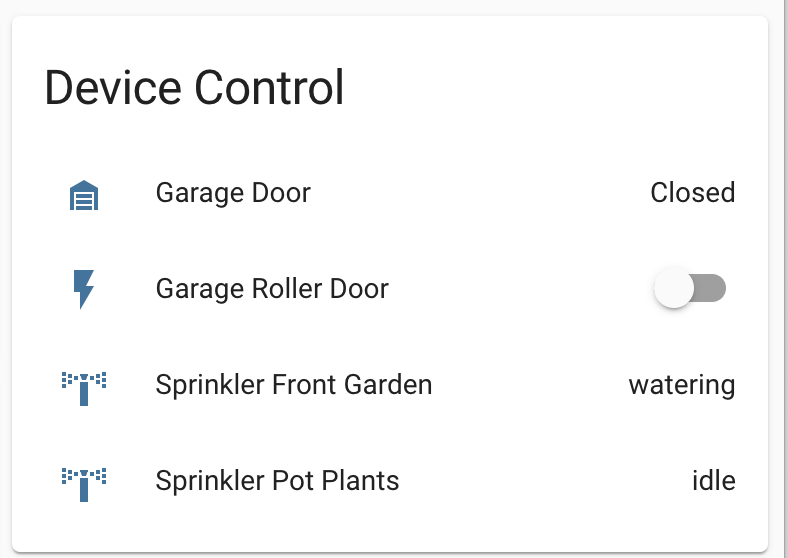

# Home Assistant
I'm home grown in New Zealand  You'll generally see NZ links. I enjoy tinkering in Home Assistant in my down time. If you find something useful in here, Yay!

## Hardware
* [ODROID-N2+ with 4GByte RAM](https://www.hardkernel.com/shop/odroid-n2-with-4gbyte-ram-2/)
* [128GB eMMC Module N2 Linux](https://www.hardkernel.com/shop/128gb-emmc-module-n2-linux-2/)
* [USB3.0 eMMC Module Writer](https://www.hardkernel.com/shop/usb3-0-emmc-module-writer/) used to flash Home Assistant onto the eMMC module.
### Previous Server Hardware
* [Raspberry Pi 4 Model B 4GByte RAM](https://www.raspberrypi.org/products/raspberry-pi-4-model-b/?variant=raspberry-pi-4-model-b-4gb
* [PoE+ HAT](https://www.raspberrypi.org/products/poe-plus-hat/)
* [Argon NEO Raspberry Pi 4 Case](https://www.amazon.com/Argon-Raspberry-Heatsink-Supports-Accessible/dp/B07WMG27T7) 

### Software Components
* [MariaDB running in a Docker Container](https://hub.docker.com/_/mariadb)
* [ESPHome](https://esphome.io/)
* [Mosquitto broker](https://github.com/home-assistant/addons/tree/master/mosquitto)
* [NGINX Home Assistant SSL proxy](https://github.com/home-assistant/addons/tree/master/nginx_proxy)
* [Samba share](https://github.com/home-assistant/addons/tree/master/samba)
* [Terminal & SSH](https://github.com/home-assistant/addons/tree/master/ssh)
* [Node-RED](https://github.com/hassio-addons/addon-node-red)
* [Visual Studio Code](https://github.com/hassio-addons/addon-vscode)

### DD7002B WIFI Bridge
Jump to: [RS485 control of the DD7002B WIFI Bridge](#rs485-control-of-the-dd7002b-wifi-bridge)

* [EZSync010](https://purenitetech.com/product/ezsync010/)
* [WIFI Bridge DD7002B](https://www.ismartwindow.co.nz/DD7002B_WIFI_bridge.html)
### OpenSprinkler
Jump to: [MQTT monitoring of OpenSprinkler](#mqtt-control-monitoring-of-opensprinkler)

* [OpenSprinkler OS3.0 AC-Powered](https://opensprinkler.com/product/opensprinkler/)
* [Ring AC Power Adapter](https://ring.com/au/en/products/video-doorbell-plugin-adapter-gen-2) I'm actually using the first generation power adapter for a 'Ring Video Doorbell Pro'
* [Pope 25mm Solenoid Valve With Flow Control](https://www.popeproducts.com.au/irrigation/automated-control-and-accessories/valves/25-mm-solenoid-valve-with-flow-control)
### Shelly
Jump to: [Shelly](#shelly)

* [Shelly 1](https://shelly.cloud/products/shelly-1-smart-home-automation-relay/)
* [Shelly 1PM](https://shelly.cloud/products/shelly-1pm-smart-home-automation-relay/)
* [Shelly 2.5](https://shelly.cloud/products/shelly-25-smart-home-automation-relay/)
* [Shelly Dimmer 2](https://shelly.cloud/products/shelly-dimmer-2-smart-home-light-controller/)
* [Shelly Button1](https://shelly.cloud/products/shelly-button-1-smart-home-automation-device/)
### Zigbee
* [Zigbee USB gateway ConBee II](https://www.phoscon.de/en/conbee2)
* [Philips Hue](https://www.philips-hue.com/en-nz)

## Home Assistant Glow 🌟
Additonal components:
* [IP65 Sealed ABS Enclosure](https://www.jaycar.co.nz/ip65-sealed-abs-enclosures-dark-grey-with-mounting-flange-64x58x35mm/p/HB6121)
* [Vented ABS Enclosure](https://www.jaycar.co.nz/grey-vented-abs-enclosure-40-x-40-x-20mm/p/HB6114)

Including the hardware discussed here:
https://github.com/klaasnicolaas/home-assistant-glow
No additonal changes made to Klaas's configuration
## MQTT ~~control~~ monitoring of OpenSprinkler
Open Sprinkler MQTT [documentation](https://openthings.freshdesk.com/support/solutions/articles/5000859089-how-to-use-mqtt)


### Requirements
* OpenSprinkler OS3.0
* https://github.com/home-assistant/addons/tree/master/mosquitto
#### configuration.yaml
https://www.home-assistant.io/integrations/sensor.mqtt/
```yaml
default_config:
homeassistant:
  customize_glob: !include customize_glob.yaml
sensor:
  - platform: mqtt
    name: "Sprinkler Pot Plants"
    state_topic: "opensprinkler/station/0"
    value_template: >-
      
        watering
      
        idle
      
```
#### customize_glob.yaml
```yaml
sensor.sprinkler_*:
  icon: mdi:sprinkler-variant
```
## RS485 control of the DD7002B WIFI Bridge
### Requirements
* DD7002B WIFI Bridge firmware 0.8.0 or greater
* EZSync010 or other RS485 bridge
#### Wiring EZSync010 to DD7002B, RS485 Interface
EZsync010 was terminated to a RJ9/4P4C plug

| EZSync010 | RJ9/4P4C | Function |
| ------------- | ------------- | ------------- |
| Black | 1 | Ground |
| - | 2 | - |
| Orange | 3 | 485A |
| Yellow | 4 | 485B |
| Red | - | Power |
| Brown | - | Terminator 1 |
| Green | - | Terminator 2 |

'-' denotes not in use


Further Documentation:

* [DD7002B](/Assets/README/DD7002B_Docs)
* [EZSync010](/Assets/README/EZsync010_Docs)

### Drivers
#### macOS Catalina
No additional drivers required
#### Windows 10 1909
Drivers for chipset https://www.ftdichip.com/FTDrivers.htm
#### Raspberry Pi
No additional drivers required
#### ODROID-N2+
No additional drivers required

### Connecting to Bridge Raspberry Pi
Install Screen if required
```Shell
sudo apt-get install screen
```
```Shell
screen /dev/ttyUSB0 9600
```
### Connecting to Bridge macOS Catalina
List USB devices in the OS to retreive the device name of the EZSync010 assigned in the OS.

```Shell
ls /dev/tty.*
/dev/tty.Bluetooth-Incoming-Port	/dev/tty.usbserial-AB0KFHEJ
```
Connect to EZSync010 and specify the baud rate
```Shell
screen /dev/tty.usbserial-AB0KFHEJ 9600
```
### Blind information

| Value  | Description |
| ------------- | ------------- |
| !123D005vZ10  | Lounge 1, One Way Blind |
| !123D006vZ10  | Bedroom, One Way Blind |
| !123D003vU10  | Kitchen Blind, Two Way Blind |
### Issue Commands
#### Query Bridge
```Shell
!123D000v?;
```
##### Response
```Shell
!123D001vZ10;!123D002vZ10;!123D003vU10;!123DFFFv000;
```
#### Open a Blind
```Shell
!123D003vU10o;
```
#### Close a Blind
```Shell
!123D003vU10c;
```
#### Stop a Blind
```Shell
!123D003vU10s;
```
#### Query a bidirectional Blind postion
```Shell
!123D003vU10q;
```
### Control blinds with Home Assistant

#### configuration.yaml
https://www.home-assistant.io/integrations/cover.command_line/
```yaml
default_config:
homeassistant:
  customize_glob: !include customize_glob.yaml
cover:
  - platform: command_line
    covers:
      blind_lounge_se:
        command_open: '/bin/bash -c "( stty raw speed 9600 >&2; echo -ne ''!123D005o;'' ) >/dev/ttyUSB0 <&1"'
        command_close: '/bin/bash -c "( stty raw speed 9600 >&2; echo -ne ''!123D005c;'' ) >/dev/ttyUSB0 <&1"'
        command_stop: '/bin/bash -c "( stty raw speed 9600 >&2; echo -ne ''!123D005s;'' ) >/dev/ttyUSB0 <&1"'
        friendly_name: Lounge South East
      blind_bedroom_master:
        command_open: '/bin/bash -c "( stty raw speed 9600 >&2; echo -ne ''!123D006o;'' ) >/dev/ttyUSB0 <&1"'
        command_close: '/bin/bash -c "( stty raw speed 9600 >&2; echo -ne ''!123D006c;'' ) >/dev/ttyUSB0 <&1"'
        command_stop: '/bin/bash -c "( stty raw speed 9600 >&2; echo -ne ''!123D006s;'' ) >/dev/ttyUSB0 <&1"'
        friendly_name: Bedroom Master
```
#### customize_glob.yaml
```yaml
cover.blind_lounge_se:
  icon: mdi:blinds
cover.bedroom_*:
  icon: mdi:blinds
```
## Shelly

Shelly API Documentation https://shelly-api-docs.shelly.cloud/

Shelly Gen 1 Firmware Change Log https://shelly-api-docs.shelly.cloud/gen1/#changelog

Shelly Gen 2 Firmware Change Log https://shelly-api-docs.shelly.cloud/gen2/changelog
### Shellies Discovery
Initially used https://github.com/bieniu/ha-shellies-discovery and MQTT which worked well, however I migrated to native Shelly Integration CoIoT

### CoIoT
Be sure to configure Home Assistant IP address and port don't use Multicast


